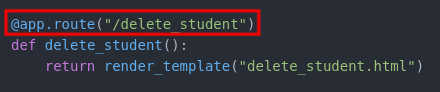
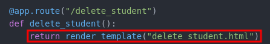
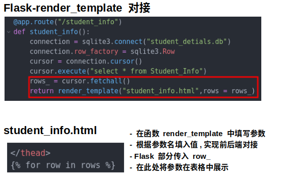
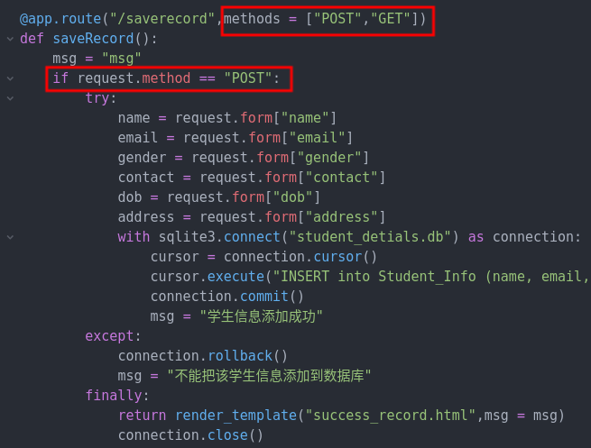
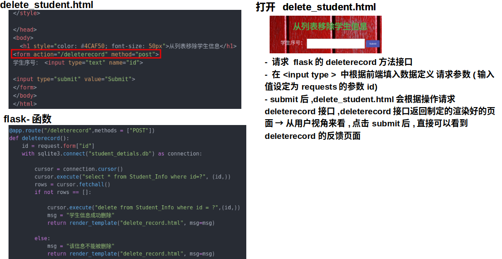
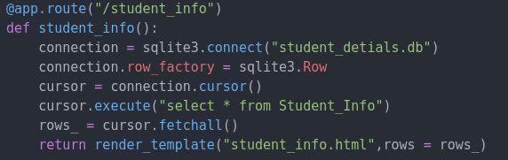

# Main
```
主要内容
  - 路由定义
  - 网页渲染
  - 接口过滤
  - 函数调用
  - 数据存储
```
---

# 路由定义
> 
>
> - **输入 http://127.0.0.1:5000/delete_student ,则进入对应的函数中的渲染页面**

# 网页渲染
> **简单渲染**
>
> 
>
> - **选择 .html 文件进行渲染**
>
> ---
>
> **含参渲染**
>
> 

# 接口过滤
> 
>
> - **限制请求方法与根据请求方式选择性操作**

# 函数调用
> 

# 数据存储
> 
>
> - **采用直接编辑 .db 文件实现数据存储**
