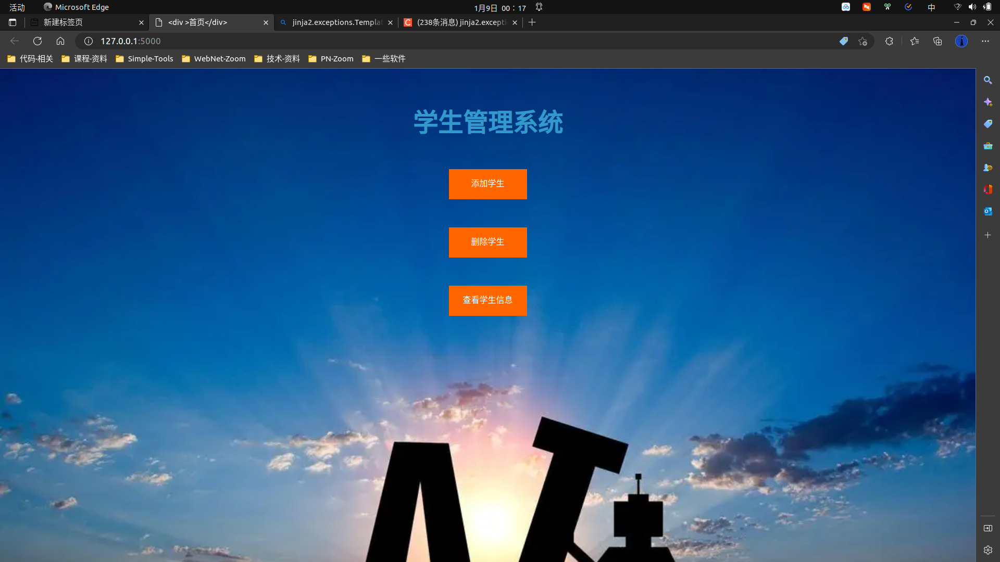
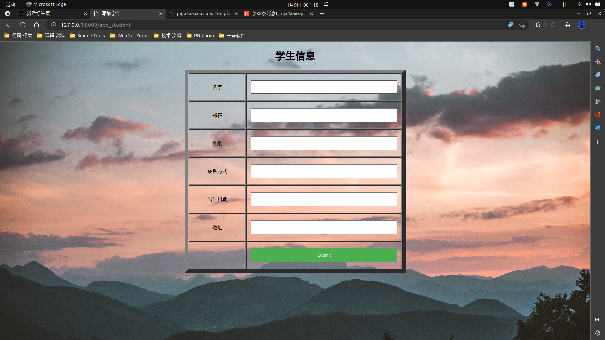
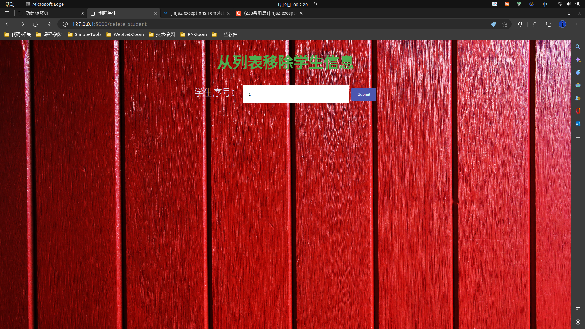
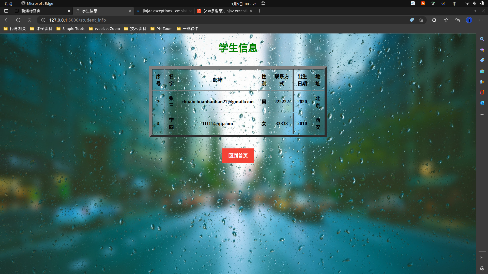

# 项目演示

## @app.route("/")
>

## @app.route("/add_student")
>

## @app.route("/saverecord",methods = ["POST","GET"])
> - 是用于实现功能的方法

## @app.route("/delete_student")
> 

## @app.route("/student_info")
> 

## @app.route("/deleterecord",methods = ["POST"])
> - 是用于实现功能的方法
